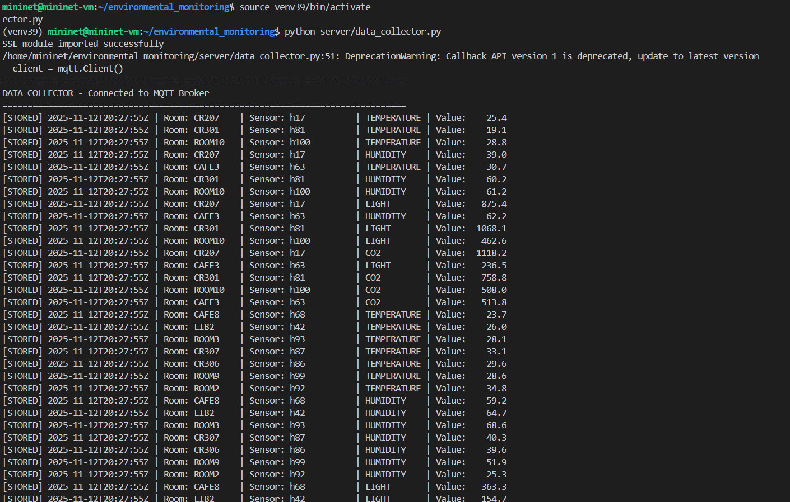
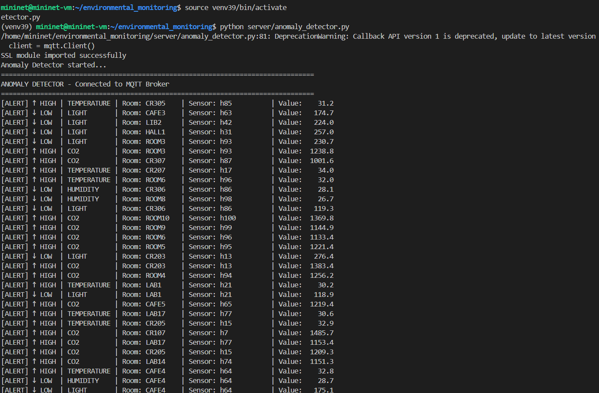
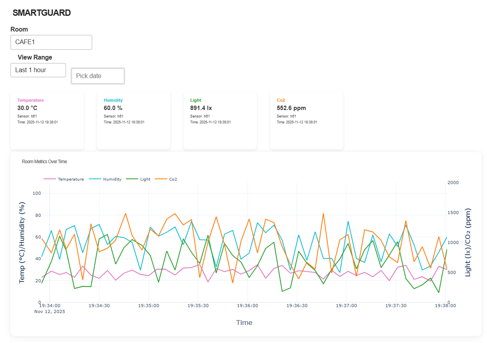
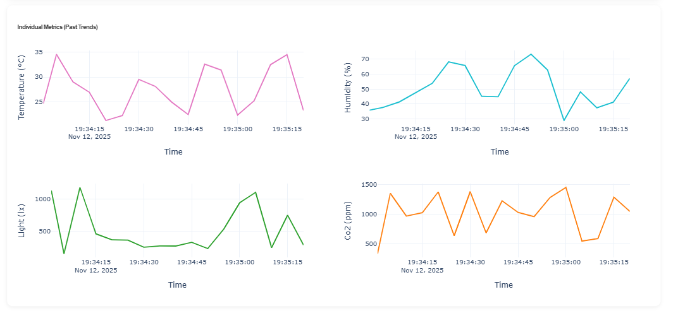
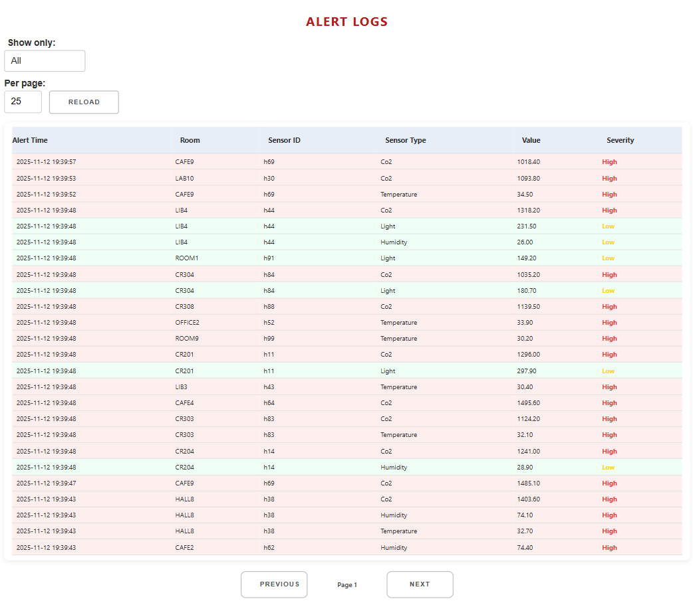
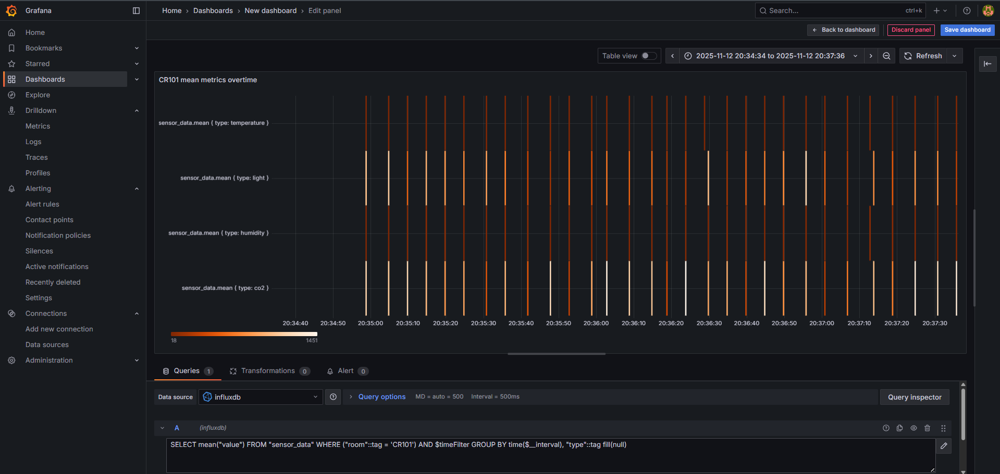
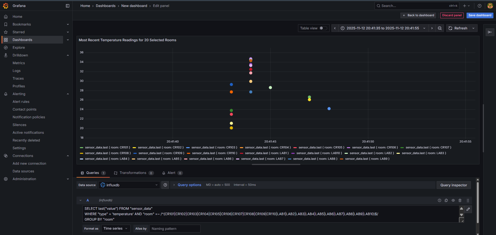

# SmartGuard: Centralized Environmental Monitoring System

## Overview
SmartGuard is a **simulation-based centralized monitoring system** designed for campuses. It collects and analyzes real-time environmental data **temperature, humidity, light, and CO₂** from simulated classrooms and labs. A network of 100 Mininet-hosted virtual sensor clients transmit their readings using **MQTT** to a broker, from which two backend services (data collector & anomaly detector) store and monitor the data in **InfluxDB**. Insights are served via a **Dash** (or **Grafana**) dashboard featuring heatmaps, time-series trends, and real-time anomaly alerts.

***

## System Architecture

```txt
 launch_all_sensors.py
       ↓
Creates Mininet network (switch + 100 hosts)
       ↓
Each host runs sensor_simulator_multiroom.py (Publisher)
       ↓
Publishes JSON data via MQTT TCP (port 1883)
       ↓
             ┌───────────────────┐
             │  MQTT Broker      │  (Mosquitto on 10.0.0.254)
             └──────┬────────────┘
                    │
         ┌──────────┴──────────────┐
         │                         │
 (Subscriber 1)               (Subscriber 2)
 data_collector.py          anomaly_detector.py
   ↓                           ↓
Writes sensor_data          Detects anomalies
 to InfluxDB                 Stores alerts to InfluxDB
   ↓                           ↓
        └───────→ Dash/Grafana Dashboard (heatmaps, trends, alerts)
```

***

## Components & Directory Structure

```txt
environmental_monitoring/
 ├── launch_all_sensors.py           # Launches Mininet and all 100 sensor hosts
 ├── setup_network.sh                # Enables routing & NAT for Mininet hosts
 ├── sensors/
 │     └── sensor_simulator_multiroom.py       # Simulated sensor publisher (per host)
 ├── server/
 │     ├── data_collector.py         # MQTT Subscriber: stores sensor_data in InfluxDB
 │     └── anomaly_detector.py       # MQTT Subscriber: detects threshold violations & records alerts
 ├── dashboard/
 │     ├── Frontend                    # Dash dashboard UI & API front-end
 │     └── Backend                    # Flask API for dashboard (data to/from InfluxDB)
```

Ports used:
- **MQTT Broker (Mosquitto):** `10.0.0.254:1883` (within Mininet)
- **InfluxDB:** `localhost:8086`
- **Dash Web Dashboard:** `http://localhost:8050` (forwarded or from host)
- **Grafana Dashboard (optional):** `http://192.168.56.103:3000` (access from host browser)
- **Backend Flask API:** `http://localhost:5000`

***

## Prerequisites
- **VM Environment:**
  - Ubuntu 20.04.6 VM (VirtualBox, bridged via NAT for internet and Host-only for local SSH)
  - 2 network adapters:
    - `Adapter 1`: NAT (external internet)
    - `Adapter 2`: Host-only (for PowerShell/SSH and local access)
- **Software:**
  - [Mininet](http://mininet.org)
  - [Mosquitto MQTT Broker](https://mosquitto.org)
  - [InfluxDB](https://www.influxdata.com)
  - [Python 3.8+/3.9+], `pip`, required packages (`paho-mqtt`, `influxdb`, `dash`, `flask`, `plotly`, `requests`, `pytz`, `pandas`)
  - [Grafana](https://grafana.com) (optional)

***

## Network Setup After Reboot
1. **Ensure both VM adapters are active.**
2. **Activate NAT (internet) on VM:**
    ```bash
    sudo ip link set eth1 up
    sudo dhclient eth1
    ```
    - `eth1` (NAT) will get an IP (e.g., `10.0.2.15`).
    - `eth0` (Host-only) will stay as (e.g., `192.168.56.103`).

***

## Launch Sequence (Terminal Startup Order)

1. **Terminal 0: Setup Routing & NAT for Mininet**
    ```bash
    cd ~/environmental_monitoring
    ./setup_network.sh
    ```
    - Enables IP forwarding and NAT for Mininet's private network.

2. **Terminal 1: Start Mininet & Launch Sensor Clients**
    ```bash
    sudo mn -c
    cd ~/environmental_monitoring
    sudo python3 launch_all_sensors.py
    ```
    - Starts Mininet, creates 100 virtual hosts, each running a multi-room Python sensor publisher.

3. **Terminal 2: Assign IP to Mininet Switch (MQTT Broker IP)**
    ```bash
    cd ~/environmental_monitoring
    sudo ip addr add 10.0.0.254/8 dev s1
    sudo ip link set s1 up
    ```
    - Assigns `10.0.0.254` to switch for MQTT broker access from all Mininet hosts.

4. **Terminal 3: Start Data Collector (subscribes and stores sensor data)**
    ```bash
    cd ~/environmental_monitoring
    source venv39/bin/activate
    python server/data_collector.py
    ```

5. **Terminal 4: Start Anomaly Detector (subscribes and stores alert data)**
    ```bash
    cd ~/environmental_monitoring
    source venv39/bin/activate
    python server/anomaly_detector.py
    ```

6. **(Optional) Monitor Mosquitto Broker Log**
    ```bash
    sudo tail -f /var/log/mosquitto/mosquitto.log
    ```

7. **Start Dashboard Backend/web_dashboard**
    ```bash
    export INFLUX_HOST=localhost
    export INFLUX_DB=sensor_data
    cd ~/environmental_monitoring/dashboard
    python webdashboard.py
    ```

8. **Launch Dashboard Frontend (Dash App)**
    ```bash
    cd ~/environmental_monitoring/dashboard
    python app.py
    ```
    - Access Dash at: [http://localhost:8050](http://localhost:8050) (use VM host or browser at VM IP:8050)

9. **(Optional) Launch Grafana**
    - Ensure Grafana is installed and started. Access at: [http://192.168.56.103:3000](http://192.168.56.103:3000)

***

## Code Summaries

### Sensor Publisher (`sensor_simulator_multiroom.py`)
- Each Mininet host emulates a unique sensor for a specific room.
- Publishes temperature, humidity, light, and CO₂ values to unique MQTT topics: `sensors/<metric>/<ROOM>/<SENSOR_ID>` every 5s.
- Example: `sensors/temperature/CR101/h1`

### Data Collector (`server/data_collector.py`)
- Subscribes to all sensor topics (`sensors/#`).
- Parses values, timestamps, and tags, storing them as time-series in InfluxDB (`sensor_data` measurement).

### Anomaly Detector (`server/anomaly_detector.py`)
- Subscribes to all sensor topics.
- Checks if value crosses assigned thresholds for each metric and room.
- On anomaly, prints alert and writes an alert entry in InfluxDB (`alerts` measurement).
- Thresholds (examples):
    - Temperature: min 18°C, max 30°C
    - Humidity: min 30%, max 70%
    - Light: min 300 lx, max 1500 lx
    - CO₂: min 350 ppm, max 1000 ppm

### Backend  (`dashboard/web_dashboard.py`)
- Flask service provides REST endpoints for rooms, sensor lists, latest readings, history, and alerts.
- Interacts with InfluxDB to fetch/store time-series and alert data.
- Serves thresholds as `/api/thresholds`.

### Frontend (`dashboard/app.py`)
- Dash web app shows:
  - **Room selector** with live metrics per room
  - **Time-series trends** for all metrics (4 subplots per room)
  - **Alert log table** with severe events in red/yellow
  - **Range/date filters** for flexible data browsing

### Heatmaps & Grafana
- Grafana dashboard can be configured to show room-by-room heatmaps and historic metric trends via InfluxDB queries.
- Access Grafana at: `http://192.168.56.103:3000` (login: admin/admin by default)

***

## Example Outputs

- **Data Stored:**
    ```
    [STORED] 2025-11-10T21:56:34Z | Room: OFFICE9 | Sensor: h59        | CO2        | Value: 1329.7
    [STORED] 2025-11-10T21:56:34Z | Room: ROOM10  | Sensor: h100       | HUMIDITY   | Value:  70.4
    ```
<div align="center">
  
</div>


- **Anomaly Alerts:**
    ```
    [ALERT] ↑ HIGH | TEMPERATURE | Room: CAFE2   | Sensor: h62        | Value:  31.0
    [ALERT] ↑ HIGH | CO2         | Room: OFFICE6 | Sensor: h56        | Value: 1416.1
    ```
<div align="center">
  
</div>


- **Dash or Grafana dashboard:**
    - Real-time cards display each metric per room
    - Room selector, alerts, filters
    - Visual time trends & outlier highlighting

<table>
  <tr>
    <td></td>
    <td></td>
  </tr>
  <tr>
    <td></td>
    
  </tr>
  <tr>
    <td></td>
    <td></td>
  </tr>
</table>


***

## Notes & Troubleshooting
- **Network routing must be enabled** (`setup_network.sh` or manual commands) after every VM reboot to let Mininet hosts reach external services.
- If Dash/API is run inside the VM, either port-forward the Dash port (`8050`) or access via VM host-only IP + port.
- **MQTT topics** are structured: `sensors/<metric>/<ROOM>/<SENSOR_ID>`
- **InfluxDB** database name: `sensor_data`
- **Alert measurement** in InfluxDB: `alerts`

***

## Ports & IPs
| Service               | IP Address/Host            | Port   | Access Example                    |
|-----------------------|----------------------------|--------|-----------------------------------|
| Mosquitto Broker      | 10.0.0.254 (Mininet switch)| 1883   | MQTT connect from sensors         |
| InfluxDB              | localhost (VM)             | 8086   | Server & API use this             |
| Dash Frontend         | localhost or Host-only IP  | 8050   | http://192.168.56.103:8050        |
| Grafana (optional)    | Host-only IP or localhost  | 3000   | http://192.168.56.103:3000        |
| Flask Backend API     | localhost                  | 5000   | http://localhost:5000/api/rooms   |

***

**If you need help with shortcuts, code fixes, or deployment steps, just ask!**

***
